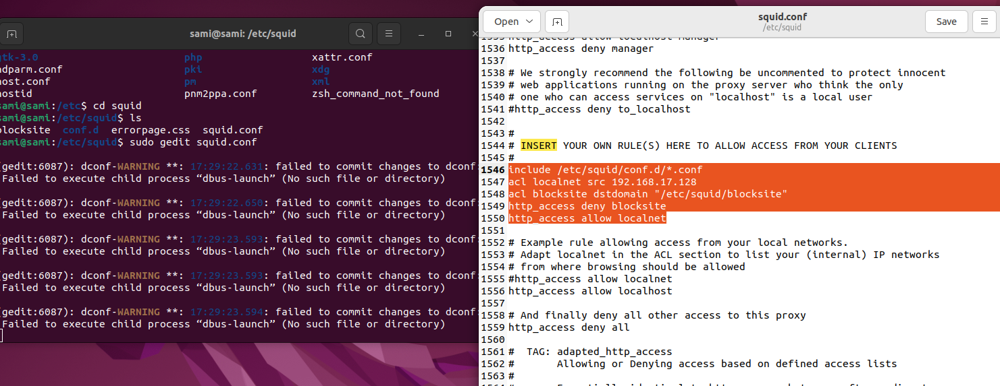
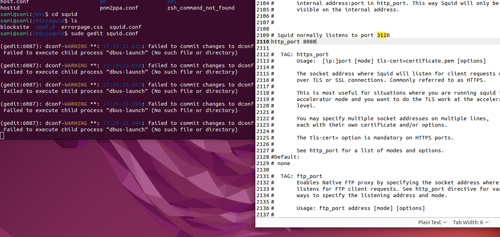
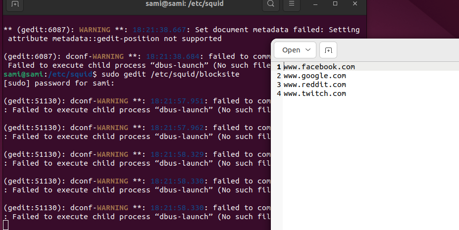
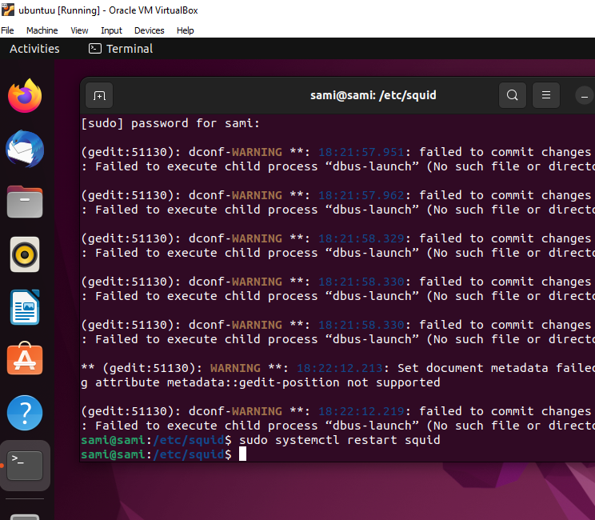
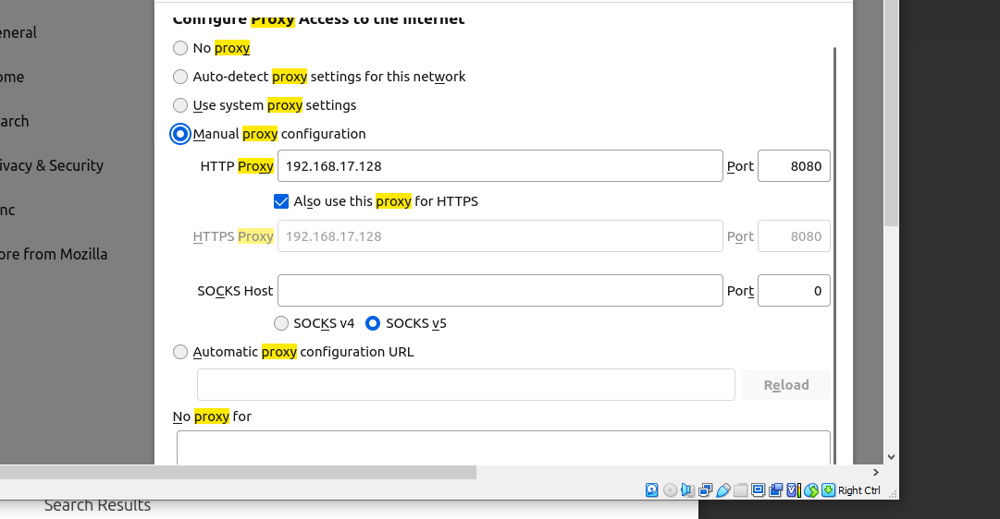
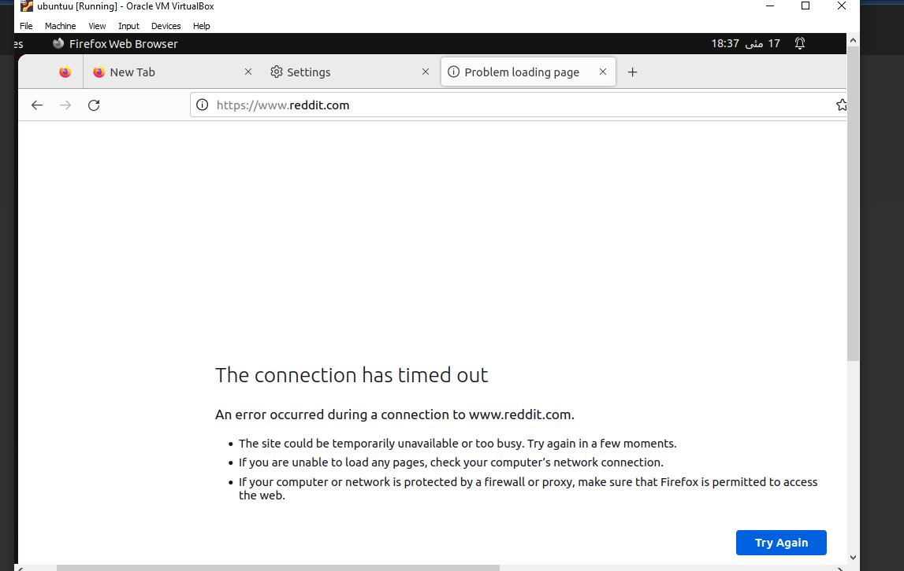

# lab11
## Installing Squid

## Configure the file Squid.conf
and change the port number too

## Make another File 
using this commnand sudo gedit /etc/squid/blocksite and enter which website you want to block 

## Restart the Squid 

## GO to browser and and change proxy setting as given below 

## now you can check the website you wanted to block are blockes

